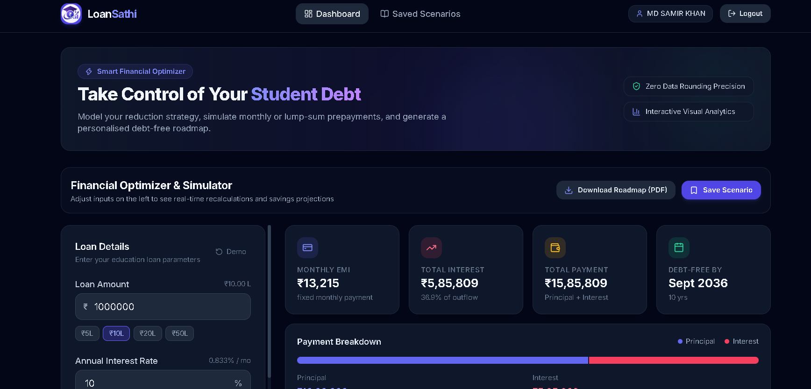
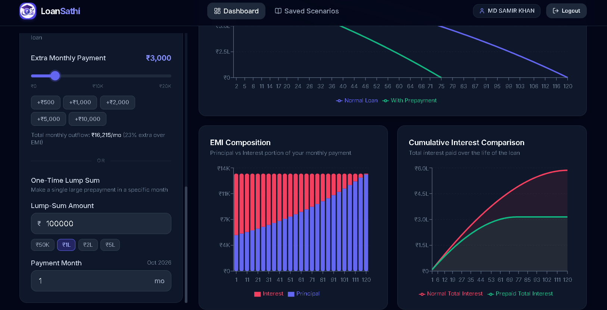
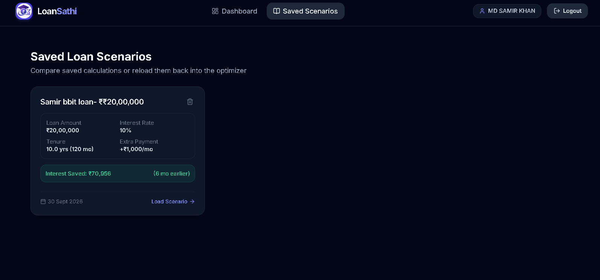
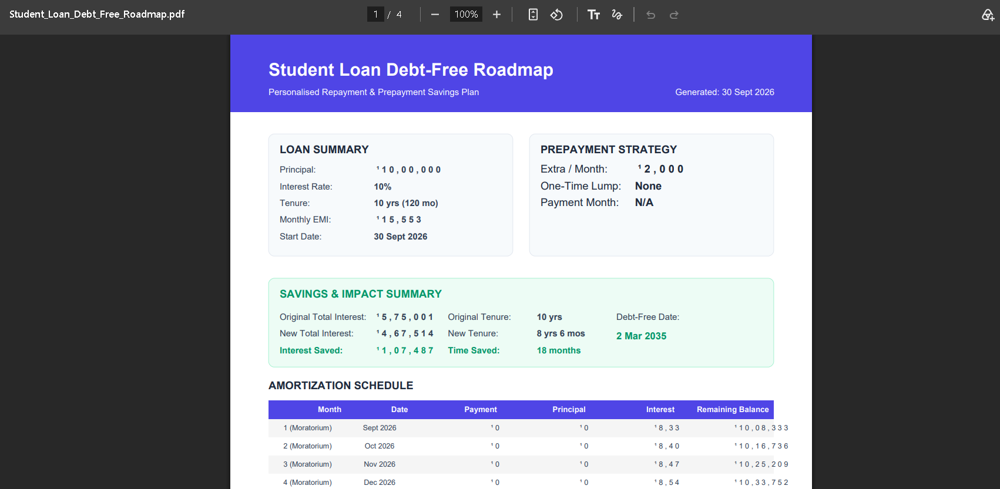

# Student Loan EMI & Prepayment Optimizer

> An intelligent, full-stack financial optimization platform designed to help graduates analyze, simulate, and accelerate their student loan repayments to save lakhs in interest and become debt-free years earlier.

---

## 📌 Problem Statement

Student loans are a significant financial burden for graduates entering the workforce. Traditional banking calculators only display the fixed monthly EMI, obscuring the dramatic long-term impact of compound interest and moratorium periods. 

Borrowers often lack clarity on:
- How interest accumulates during college moratorium periods.
- How small, consistent extra monthly payments or lump-sum prepayments can drastically reduce total interest.
- Exactly when they will become debt-free under custom repayment strategies.

Without interactive visualization and scenario comparison tools, students miss out on saving substantial amounts of money and shortening their loan tenure.

---

## 🎯 Real-World Motivation

An average education loan of **₹10,00,000** at **10% interest for 10 years** results in **₹5,85,809** paid purely in interest—over **58%** of the original loan amount!

By prepaying just **₹2,000 extra per month**, a borrower can:
- Save **₹1,67,423** in total interest.
- Become debt-free **2.5 years earlier**.

The **Student Loan Optimizer** bridges the financial literacy gap by giving borrowers full transparency, real-time interactive charts, scenario storage, and a downloadable PDF roadmap.

---

## ✨ Key Features

- **High-Precision Financial Engine**: Pure JS, zero-rounding intermediate calculations for reducing-balance EMI, moratorium capitalization, and amortization.
- **Moratorium Period Simulator**: Models interest capitalization during study/grace periods before EMI repayment begins.
- **Accelerated Prepayment Simulator**: Interactive sliders and quick-pick presets for extra monthly payments and designated lump-sum prepayments.
- **Real-Time Financial Visualizations**: Interactive Recharts graphs showing Remaining Balance over time, Principal vs. Interest split, and Cumulative Interest comparisons.
- **Side-by-Side Scenario Comparison**: Instant breakdown comparing Original vs. Prepaid tenure, interest saved, and new debt-free date.
- **User Accounts & Scenario Manager**: Secure JWT authentication and MongoDB Atlas database to save, compare, and reload custom loan strategies.
- **Downloadable Debt-Free Roadmap**: Generates a professional, multi-page printable PDF report with full amortization schedules using `jsPDF`.
- **Responsive Fintech UI**: Modern dark-mode interface built with Tailwind CSS, supporting mobile navigation drawers and smooth micro-interactions.

---

## 🛠️ Technology Stack

### Frontend
- **Framework**: React 19 + Vite
- **Styling**: Tailwind CSS + Lucide Icons
- **Data Visualization**: Recharts
- **PDF Generation**: jsPDF + jsPDF-AutoTable
- **HTTP Client**: Axios

### Backend
- **Runtime**: Node.js + Express
- **Database**: MongoDB Atlas + Mongoose ORM
- **Authentication**: JSON Web Tokens (JWT) + bcryptjs
- **Middleware**: Express Validator, CORS, Morgan

### Infrastructure & Deployment
- **Frontend Hosting**: Vercel
- **Backend Hosting**: Render
- **Database Hosting**: MongoDB Atlas

---

## 🏗️ System Architecture

```
[ React 19 Frontend (Vite) ]
       │
       ├── Pure Financial Engine (loanCalculations.js)
       ├── Recharts Visualizations
       ├── jsPDF Roadmap Generator
       │
       ▼ Axios HTTP Client (Bearer JWT)
[ Express.js REST API Server ]
       │
       ├── Authentication Middleware (protect)
       ├── Auth Controller (Register / Login / Me)
       ├── Scenario Controller (CRUD Scenarios)
       │
       ▼ Mongoose ORM
[ MongoDB Atlas Database ]
```

---

## 🧮 Financial Calculation Methodology

### 1. Standard Reducing-Balance EMI
$$\text{EMI} = \frac{P \cdot r \cdot (1+r)^n}{(1+r)^n - 1}$$
Where:
- $P$ = Principal loan amount
- $r$ = Monthly interest rate ($\text{Annual Rate} / 12 / 100$)
- $n$ = Total tenure in months

### 2. Post-Moratorium Principal Capitalization
During the moratorium period ($m$ months), no payments are made. Interest accrues monthly and capitalizes into the principal:
$$P_{\text{repayment}} = P \cdot (1+r)^m$$
The monthly EMI is then calculated on $P_{\text{repayment}}$ for the remaining tenure ($n - m$).

### 3. Prepayment & Balance Capping Algorithm
Each month $i$:
$$\text{Interest}_i = \text{Balance}_{i-1} \cdot r$$
$$\text{Principal Paid}_i = (\text{EMI} - \text{Interest}_i) + \text{Extra Monthly}_i + \text{Lump Sum}_i$$
$$\text{Balance}_i = \max(0, \text{Balance}_{i-1} - \text{Principal Paid}_i)$$
When $\text{Balance}_i = 0$, repayment ceases immediately, reducing total tenure.

---

## 🖼️ Screenshots

| Feature | Screenshot |
|---|---|
| **Interactive Dashboard** |  |
| **Financial Charts** |  |
| **Saved Scenarios** |  |
| **PDF Roadmap Export** |  |

---

## ⚡ Quick Start & Installation

### Prerequisites
- Node.js (v18+ recommended)
- npm or yarn
- MongoDB Atlas database URI

### 1. Clone & Install Dependencies

```bash
# Clone repository
git clone https://github.com/your-username/student-loan-optimizer.git
cd student-loan-optimizer

# Install backend dependencies
cd server
npm install

# Install frontend dependencies
cd ../client
npm install
```

### 2. Configure Environment Variables

**Backend (`server/.env`):**
```env
PORT=5000
MONGO_URI=mongodb+srv://<username>:<password>@cluster.mongodb.net/loan-optimizer?retryWrites=true&w=majority
JWT_SECRET=your_super_secret_jwt_key
JWT_EXPIRES_IN=7d
CLIENT_URL=http://localhost:5173
```

**Frontend (`client/.env`):**
```env
VITE_API_URL=http://localhost:5000/api
```

### 3. Run Development Servers

```bash
# Terminal 1: Start Backend Server
cd server
npm run dev

# Terminal 2: Start Frontend Client
cd client
npm run dev
```

Open `http://localhost:5173` in your browser.

---

## 📡 API Documentation

### Authentication Routes `/api/auth`
- `POST /api/auth/register` — Register a new user (`name`, `email`, `password`). Returns JWT.
- `POST /api/auth/login` — Login user (`email`, `password`). Returns JWT.
- `GET /api/auth/me` — Get logged-in user profile (Requires `Bearer JWT`).

### Scenario Routes `/api/scenarios` (Protected)
- `GET /api/scenarios` — Fetch all saved loan scenarios for user.
- `GET /api/scenarios/:id` — Fetch a single scenario by ID.
- `POST /api/scenarios` — Save a new loan scenario payload.
- `DELETE /api/scenarios/:id` — Delete a saved scenario by ID.

---

## 🚀 Production Deployment

- **Frontend**: Deployed on [Vercel](https://vercel.com) with SPA rewrite configuration (`client/vercel.json`).
- **Backend**: Deployed on [Render](https://render.com) as a Node.js Web Service.
- **Database**: Hosted on [MongoDB Atlas](https://mongodb.com/atlas) with 0.0.0.0/0 network access.

Refer to [`docs/DEPLOYMENT.md`](docs/DEPLOYMENT.md) for step-by-step instructions.

---

## 🔮 Future Improvements

- Refinancing rate comparison engine (Floating vs Fixed interest rates).
- Multiple active loan portfolio aggregator.
- Income-driven repayment (IDR) & tax savings (Section 80E) calculators.
- Automated email/calendar reminders for scheduled lump-sum prepayments.

---

## 📜 License
MIT License. Created for Hackathon 2026.
